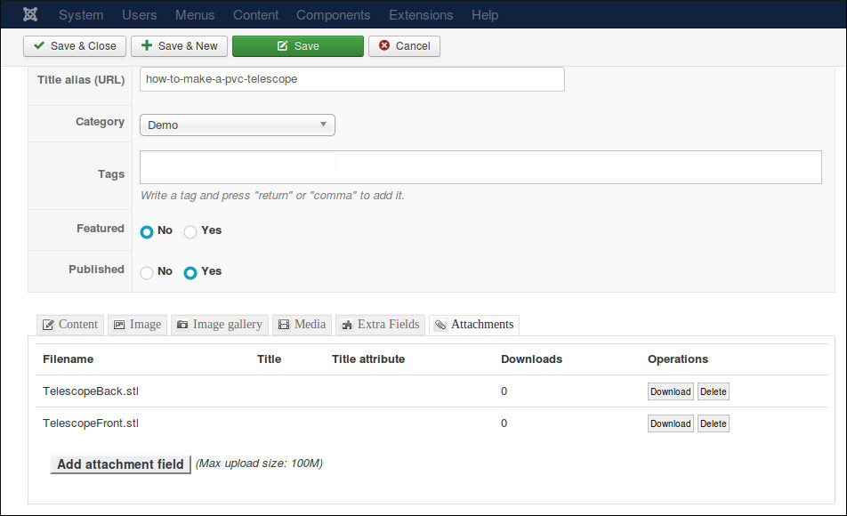

.. CM K2StepByStep documentation master file, created by
   sphinx-quickstart on Sun Feb 14 09:53:26 2016.
   You can adapt this file completely to your liking, but it should at least
   contain the root `toctree` directive.

Welcome to CM K2StepByStep's documentation!
===========================================

CM K2 StepByStep is a plugin for K2 component. The plugin helps you split K2 article into multiple pages. The purposes of this are many, you can think of:

 * Make long article easy to read.
 * Make page load faster.
 * Drive more page views.
 * Drive more ads impressions.
 * Allow visitors get a quick impression of the length of the article.

The idea of this plugin is for tutorial articles which have many steps, similar to `Instructables <http://www.instructables.com/>`_, but you can use the plugin for other kinds of article as well, for example for blogs like `Diply <http://www.diply.com/>`_.

CM K2 StepByStep plugin comes with another plugin (Finder - CMK2StepByStep). This plugin helps us delete the steps and the step's images of a K2 item when the item is deleted.

Features
--------

Back-end:

* Add, edit and delete steps.
* Have unlimited images, videos, attachments for each step.
* Supports Vimeo and Youtube videos.

Front-end:

* Navigation options: go to previous step or next step, jump to specific step.
* Ability to view the article in 1 single page.
* Full screen zoom for step's images.
* Compatible with Bootstrap 2 and 3.

Technical Requirements
----------------------

* **Joomla! 3.x.x**: CM K2 StepByStep is **NOT** compatible with Joomla! 1.x.x or 2.x.x, only Joomla! 3.x.x is supported. Please check `Joomla! 3's Technical Requirements <http://www.joomla.org/technical-requirements.html>`_ for more information.
* **K2**: CM K2 StepByStep was tested on K2 2.6.9. CM K2 StepByStep could be compatible with older versions of K2, but this is not tested yet.

============
Installation
============

Installation is easy, just like installing any other Joomla! extension. You just need to use the available tools in Extension Manager to install (Top menu -> Extensions -> Manage).

Using "Upload Package File" tab to upload the ZIP package of CM K2 StepByStep to install is the easiest and fastest way.

============
Create Steps
============

Access K2's item list in back-end, create a new item or edit your existing one. In your item's content, insert the tag "{k2stepbystep}" where you want your steps to be shown.

Below the content editor is the fields for steps. In Display setting, you can configure to show the steps in 1 single page or split them into multipages.

.. image:: images/k2_item_detail_03.jpg

To add a new step, you click "New Step" button.

In "Step" field, you enter the number of the step, this number decides what step is shown first. This number is not shown in front-end, for example, you have 3 steps with the step numbers 1, 3 and 5, in front-end you see 3 steps 1,2, and 3, not 1, 3 and 5.

You enter step's title and step's instruction into "Title" and "Instruction" fields.

To add an image to the step, you click "Add Image" button and select/upload an image with K2's file manager.

To insert an attachment to the step, you need to add this attachment to K2 item first. The reason is CM K2StepByStep is not a component so it can't handle file download, so we need to let K2 handle this.

Swich to "Attachments" tab, you add attachments to K2 item.

After you save K2 item, you copy the filename of the attachment you want to add to your step.

Paste the filename into "Attachments" field of your step. To add a new attachment you click "Add Attachment" button.

.. image:: images/k2_item_detail_10.jpg

To add another step, you click "New Step" button, the new step is added below the last step. To change the ordering of your steps, you just need to adjust their step numbers.

To add a Youtube or Vimeo video, you click "Add Video" button and paste your Youtube or Vimeo video link into the field.

In front-end, if you show steps in multipages, you can see the first step is shown where you put the tab "{k2stepbystep}" on K2 item page. At the bottom of the step, there is a navigation section where you can view all steps in 1 page, go the the next/previous step or a specific step (all of these depend on what you configure in CM K2StepByStep plugin).

Go to the page of another step, you can see there is only that step shown. Other steps or K2 item's content is not shown.

Click on the step's image to view the image (and other images) in fullscreen popup.

========
Override
========

To customize the output of CM K2StepByStep in front-end, we recommend you override it by using the below method, instead of modifying CM K2StepByStep's file directly. In this way your customizatins will not be lost because the files are overwritten everytime you update CM K2StepByStep.

To customize the output of the steps, you copy the files plugins/k2/cmk2stepbystep/layouts/step.php to plugins/k2/cmk2stepbystep/overrides folder, then start customizing step.php file in "overrides" folder.

To customize the output of navigation section, you do the same with the file plugins/k2/cmk2stepbystep/layouts/navigation.php.

===========
Translation
===========

The language strings of CM K2StepByStep are stores in plugins/k2/cmk2stepbystep/language/en-GB/ folder. You can refer to these files to override the text with your own one by using Joomla! language override tool in back-end.